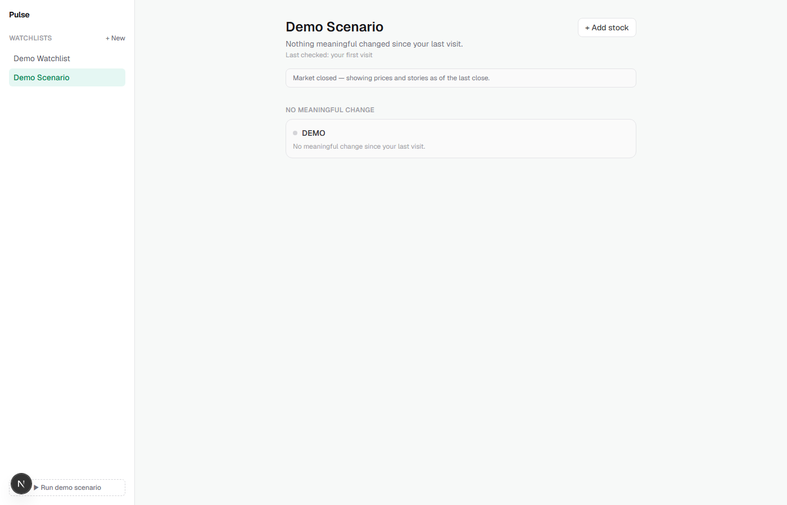
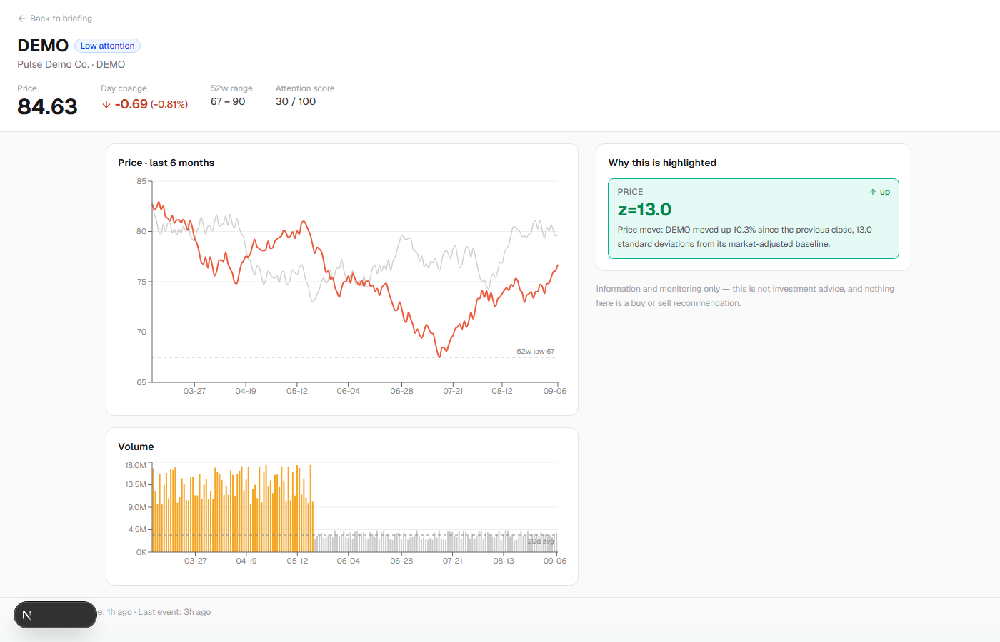

# Pulse

A stock watchlist that tells you what actually changed, not just what moved. Most watchlists show live prices; Pulse watches your stocks in the background and surfaces only the changes that genuinely deserve attention, ranked by a per-stock attention score.

**Live demo:** [groww-pulse-oysm.onrender.com](https://groww-pulse-oysm.onrender.com)
(free-tier host, first load after idle takes 30 to 60 seconds to wake up)


## Screenshots

| Briefing feed | Stock detail |
|---|---|
|  |  |

## What it does

1. **Create and manage a watchlist.** Search for a stock by symbol or name and add it.
2. **See the latest market information.** Price, day change, 52 week range, and history for every stock you're watching.
3. **See what changed since you last checked.** A background pipeline polls the market and recomputes each stock's rolling stats, then flags moves that are statistically meaningful for that specific stock, not generic noise. Every visit shows a clean summary of what happened while you were away.

## What counts as meaningful

Six signal checks run on every symbol: price move (adjusted for the market's own move that day), volatility expansion, volume anomaly, relative performance versus the index, a 52 week high or low, and an opening gap. Each fires only past a threshold tuned for that stock's own normal behavior, so a quiet stock's small move and a volatile stock's big move are judged fairly against their own history. Firing signals combine into one attention score per stock, and stocks with nothing meaningful get grouped into a quiet, low-emphasis section instead of cluttering the feed.

## Quick start

```bash
npm install
npx prisma migrate deploy
npm run dev
```

Open `http://localhost:3000`. `MARKET_PROVIDER` defaults to `replay`, a deterministic simulated feed that needs no API key. Click "Run demo scenario" in the sidebar for a scripted walkthrough. See `.env.example` to switch to real market data via Twelve Data.

## Architecture

```
Twelve Data or ReplayProvider
        |
        v
Ingest poller (idempotent, out of order safe)
        |
        v
SQLite / Postgres
        |
   +----+----+
   |         |
Evaluation   API routes
tick         (watchlists, changes, ack)
   |         |
   +----+----+
        |
        v
React briefing UI
```

One background process polls the market and recomputes stats and signals. The API layer reads from that shared state and applies a per-user watermark to decide what's new for you specifically. Signals are computed once per symbol, not once per user watching that symbol, so the cost of the system scales with the number of distinct stocks being watched, not the number of users watching them.

Race safety: quote writes are idempotent (an out of order or duplicate tick can never overwrite a newer one), and the per-user "seen" watermark only ever advances, using a safety lag so a slow, concurrent write can't be skipped past. Covered directly in `src/lib/watermark/__tests__/invariants.test.ts`.

## Scope cuts

| Not built | Why |
|---|---|
| Auth / login | Out of scope for this build. The schema already models multi user watchlists and per user read state; there's one resolved demo user instead of a login flow. |
| Trading / order placement | Not the product. This is an information and monitoring tool only, no buy or sell language anywhere. |
| Deep chart interactivity | Native chart tooltips instead of custom popovers, signal rows shown flat instead of expandable. |
| WebSockets / streaming | REST polling is enough for a "check in occasionally" product; the provider interface supports swapping in streaming later without touching business logic. |

## Deploying

This runs a persistent background poller, so it needs a host that keeps a normal long lived process alive, not a serverless platform. `render.yaml` in this repo is a ready to use Render Blueprint: push to GitHub, then on Render choose New, Blueprint, and point it at the repo. `MARKET_PROVIDER=replay` by default so the deployed demo never depends on live market hours or API credits. To use real market data instead, add `TWELVEDATA_API_KEY` as a secret and set `MARKET_PROVIDER=twelvedata`.

The free tier spins down after about 15 minutes idle and cold starts on the next request. The disk is ephemeral, so the database resets on every restart; the app auto seeds a demo watchlist on first boot so a fresh deploy is never empty.

## Compliance

No "buy", "sell", or price targets anywhere in the product. Tiers are labeled "High / Medium / Low attention," and the stock detail screen states outright that this is information and monitoring only, not investment advice.

## Repo map

```
src/lib/providers/    Market data abstraction, replay + Twelve Data
src/lib/ingest/       Quote polling
src/lib/seed/         Historical seed, split adjustment, rolling stats
src/lib/signals/      The six signal functions
src/lib/scoring/      Attention score + story grouping
src/lib/events/       Emit, dedupe, resolution
src/lib/watermark/    The per-user "what's changed" core
src/lib/watchlists/   CRUD
src/lib/pipeline/     Runs it all as one continuous process
src/lib/detail/       Stock detail screen's backend
src/app/api/          HTTP routes
src/components/, src/app/page.tsx                        Briefing feed UI
src/components/stock-detail/, src/app/stocks/[symbol]/   Stock detail screen
```
